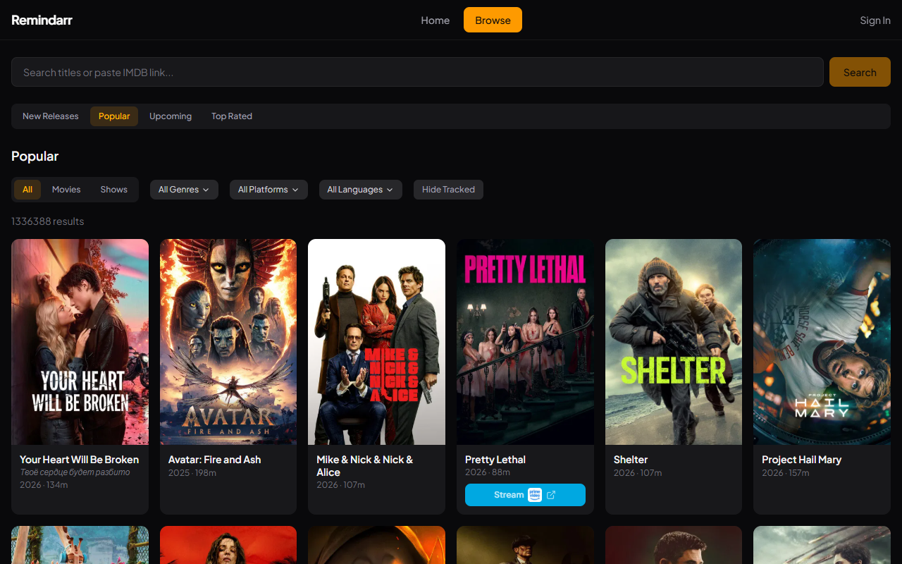

# Remindarr

A self-hosted app for tracking streaming media releases. Browse, search, and get notified when movies and TV shows land on your streaming services.



## Features

- **Browse & Discover** — Popular, upcoming, and top-rated titles with genre, provider, and language filters
- **Watchlist** — Track titles and follow per-episode watched status for TV shows
- **Calendar** — Monthly calendar view of releases and upcoming episodes
- **Notifications** — Discord webhook and Web Push with configurable schedules and timezone support
- **Authentication** — Local accounts, OpenID Connect (OIDC), and WebAuthn/Passkeys
- **PWA** — Installable as a progressive web app

## Quick Start

The easiest way to run Remindarr is with Docker.

**1. Get a TMDB API key** at [themoviedb.org](https://www.themoviedb.org/settings/api) (free).

**2. Create a `docker-compose.yml`:**

```yaml
services:
  remindarr:
    image: ghcr.io/matijamaric/remindarr:latest
    ports:
      - "3000:3000"
    volumes:
      - remindarr-data:/app/data
    environment:
      - DB_PATH=/app/data/remindarr.db
      - TMDB_API_KEY=your_tmdb_api_key
      - BASE_URL=http://localhost:3000
      - BETTER_AUTH_SECRET=change_this_to_a_random_secret

volumes:
  remindarr-data:
```

**3. Start it:**

```bash
docker compose up -d
```

The app is available at `http://localhost:3000`.

## Configuration

| Variable | Required | Description |
|----------|----------|-------------|
| `TMDB_API_KEY` | Yes | TMDB API key |
| `BASE_URL` | Yes | Full URL of the app (e.g. `https://remindarr.example.com`) |
| `BETTER_AUTH_SECRET` | Yes | Random secret for signing sessions |
| `TMDB_COUNTRY` | No (default: `HR`) | Country code for streaming availability (`US`, `GB`, etc.) |
| `TMDB_LANGUAGE` | No (default: `en`) | Language for titles |
| `DB_PATH` | No (default: `./remindarr.db`) | SQLite database path |

For OIDC, Web Push, notifications, caching, and all other options see [docs/configuration.md](docs/configuration.md).

## Development

```bash
bun install
cd frontend && bun install

bun run dev        # Start server + frontend concurrently
bun run check      # Type check + lint + tests (run before committing)
```

Requires [Bun](https://bun.sh) v1.0+.

## Stack

- **Runtime**: Bun + SQLite
- **Server**: Hono, TypeScript strict mode
- **Frontend**: React 19, Vite, Tailwind CSS 4, shadcn/ui
- **Database**: SQLite via Drizzle ORM
- **Auth**: better-auth (local, OIDC, passkeys)
