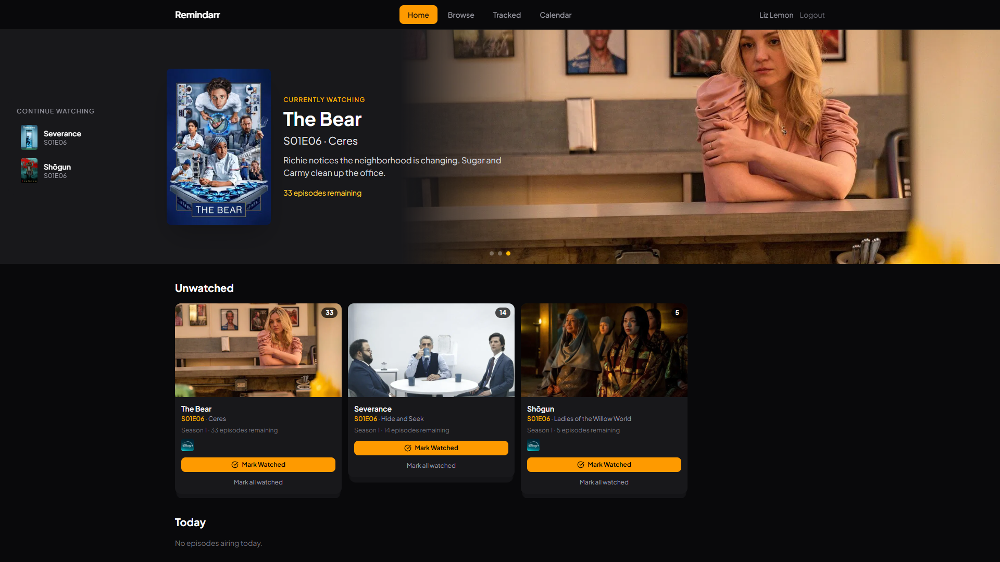

# Remindarr

A self-hosted app for tracking streaming media releases. Browse, search, and get notified when movies and TV shows land on your streaming services.



## Streaming region

Streaming availability and service lists use the instance's `TMDB_COUNTRY` (a two-letter country code, for example `US`). An administrator changes it in the server environment or Cloudflare Worker variables and restarts/redeploys the app. Run a title sync to refresh stored availability after changing the region. Provider lists may remain cached for up to 24 hours.

Your profile country is biographical; it does not change streaming availability. Per-user travel regions are not currently supported. Settings → Subscriptions, Browse, and title availability show the effective instance region.

## Features

- **Browse and discovery** — Movies, shows and people; provider, genre and language filters, recommendations and Reels.
- **Library** — Tracking, title status, tags, owned copies, watched episodes, watch history and ratings.
- **Calendar and stats** — Release calendar, calendar subscription feeds, viewing statistics, achievements and yearly Wrapped reviews. Watchlist links and year-specific review links can be revoked separately.
- **Social** — Follow people and other users, recommend titles, and control profile/activity visibility. Private profiles hide pinned favorites and named ratings; friends-only means mutual following. Anonymous rating totals remain public.
- **Notifications** — Discord, Telegram, ntfy, Gotify, webhooks and browser push, with timezone, schedule, digest and streaming-alert settings. Delivery requires a working destination; test it explicitly.
- **Integrations and data** — Plex connection/sync, JSON watchlist export/import and CSV imports. A watchlist export is not a full instance backup.
- **Authentication** — Local accounts, configurable OIDC and passkeys. External IdP/device combinations still require deployment validation ([#1173](https://github.com/MatijaMaric/remindarr/issues/1173)).
- **PWA** — Installable app. Durable offline mutations and offline reload coverage remain tracked in [#1186](https://github.com/MatijaMaric/remindarr/issues/1186) and [#1187](https://github.com/MatijaMaric/remindarr/issues/1187).

## First successful setup

1. Set the instance region with `TMDB_COUNTRY` and configure the TMDB key. Your profile country does not change availability.
2. Sign in and open the resumable setup guide on Home. Choose services in **Settings → Subscriptions**.
3. Use **Browse** to find a title and **Track** it. Rate a few titles to give discovery useful input.
4. Open **Settings → Notifications**, configure and enable a destination, and check its timezone and schedule.
5. Press **Test** for that destination, inspect delivery history, and confirm the message arrived. A successful save or browser permission grant alone is not delivery verification.

The guide can be skipped and resumed on Home. It never sends a notification automatically.

## Quick Start

The easiest way to run Remindarr is with Docker. A Cloudflare Workers deploy is also supported — see [Deploy](#deploy) below.

**1. Get a TMDB API key** at [themoviedb.org](https://www.themoviedb.org/settings/api) (free).

**2. Create a `docker-compose.yml`:**

```yaml
services:
  remindarr:
    image: ghcr.io/matijamaric/remindarr:latest
    ports:
      - "3000:3000"
    volumes:
      - remindarr-data:/app/data
    environment:
      - DB_PATH=/app/data/remindarr.db
      - TMDB_API_KEY=your_tmdb_api_key
      - BASE_URL=http://localhost:3000
      - BETTER_AUTH_SECRET=change_this_to_a_random_secret

volumes:
  remindarr-data:
```

**3. Start it:**

```bash
docker compose up -d
```

The app is available at `http://localhost:3000`.

## Deploy

### Docker (recommended for self-hosted)

The `ghcr.io/matijamaric/remindarr:latest` image is a multi-stage build with a non-root user, a healthcheck against `/api/health`, and a `/app/data` volume for the SQLite database. Use the `docker-compose.yml` snippet above or run it directly:

```bash
docker run -d \
  -p 3000:3000 \
  -v remindarr-data:/app/data \
  -e DB_PATH=/app/data/remindarr.db \
  -e TMDB_API_KEY=... \
  -e BASE_URL=https://remindarr.example.com \
  -e BETTER_AUTH_SECRET=... \
  ghcr.io/matijamaric/remindarr:latest
```

For notifications, OIDC, backups, and every other variable see [`docs/configuration.md`](docs/configuration.md) or the committed [`.env.example`](.env.example) template.

### Reverse proxy + `X-Forwarded-For`

Bun rate limits use the network peer by default. If a reverse proxy forwards client addresses, set `TRUSTED_PROXIES` to its exact comma-separated IP addresses (for example `127.0.0.1,::1`). Only those peers may supply `X-Forwarded-For`; the chain is read from right to left until the first untrusted address. The proxy must append the actual client address or overwrite the header. Do not list public clients as trusted proxies. Workers use Cloudflare's `CF-Connecting-IP`.

Both global and authentication limits return a retryable HTTP 503 if their counter store fails. Workers use atomic D1 counters; KV is not used for enforcement. Apply database migrations before deploying this change.

### Cloudflare Workers

Remindarr ships with a [`wrangler.toml`](wrangler.toml) and a [`server/worker.ts`](server/worker.ts) entry point so the same code deploys to Workers + D1 + KV.

```bash
# Create D1 database + KV namespace (one-time)
wrangler d1 create remindarr
wrangler kv:namespace create CACHE_KV

# Apply migrations
bun run db:migrate:cf

# Set secrets
wrangler secret put TMDB_API_KEY
wrangler secret put BETTER_AUTH_SECRET
# ...and OIDC_CLIENT_SECRET / SENTRY_DSN / VAPID_* as needed

# Deploy
bun run deploy:cf
```

Runtime capabilities in the current source (external-service delivery is deployment-dependent):

| Capability                                               | Bun / Docker                              | Cloudflare Workers                                                                                |
| -------------------------------------------------------- | ----------------------------------------- | ------------------------------------------------------------------------------------------------- |
| Catalogue, library, social, stats, scoped sharing        | SQLite                                    | D1                                                                                                |
| Scheduled title/episode/trending sync                    | Local cron queue                          | D1 or Durable Object queue, five-minute recovery tick                                             |
| Daily/weekly reminders, streaming arrivals/departures    | Supported                                 | Supported; scheduled dispatch granularity is five minutes                                         |
| Cache                                                    | Memory or configured backend              | KV when bound, otherwise isolate memory                                                           |
| Rate limits                                              | In-process token buckets, per Bun process | Atomic D1 fixed-window counters                                                                   |
| Plex background sync                                     | Registered scheduled jobs                 | No periodic Plex job in the Workers cron catalogue; do not assume Bun parity                      |
| Database file backups / maintenance                      | Local backup and maintenance jobs         | Bun maintenance endpoints unavailable; use D1 backup/export tooling                               |
| External auth and notification delivery                  | Test your configured integrations         | Test your configured integrations ([#1173](https://github.com/MatijaMaric/remindarr/issues/1173)) |
| Device safe areas, text scaling, cross-browser workflows | Validation remains open                   | Validation remains open ([#1172](https://github.com/MatijaMaric/remindarr/issues/1172))           |

Existing watchlist tokens continue to open only the current watchlist. Old Wrapped links that reused those tokens no longer work: create a new link from the selected year's Wrapped page. Revoking one year's review does not revoke other years or your watchlist.

## Configuration

| Variable             | Required                       | Description                                                |
| -------------------- | ------------------------------ | ---------------------------------------------------------- |
| `TMDB_API_KEY`       | Yes                            | TMDB API key                                               |
| `BASE_URL`           | Yes                            | Full URL of the app (e.g. `https://remindarr.example.com`) |
| `BETTER_AUTH_SECRET` | Yes                            | Random secret for signing sessions                         |
| `TMDB_COUNTRY`       | No (default: `HR`)             | Country code for streaming availability (`US`, `GB`, etc.) |
| `TMDB_LANGUAGE`      | No (default: `en`)             | Language for titles                                        |
| `DB_PATH`            | No (default: `./remindarr.db`) | SQLite database path                                       |

For OIDC, Web Push, notifications, caching, and all other options see [docs/configuration.md](docs/configuration.md).

## Development

```bash
bun install --frozen-lockfile

bun run dev        # Start server + frontend concurrently
bun run check      # Type check + lint + tests (run before committing)
```

Requires [Bun](https://bun.sh) 1.4.2 (see `packageManager`). Both workspaces pin TypeScript 6.0.3. `bun run check:toolchain` checks the installed root and frontend compiler before validation; `bun run typecheck --noEmit` invokes the local compiler without downloading a different version.

For stale dependencies, remove **only** the repository's root `node_modules` and `frontend/node_modules` directories, then run `bun install --frozen-lockfile` from the root. The root `bun.lock` is authoritative for this workspace. Do not alter valid TypeScript configuration to accommodate an accidentally installed compiler major version.

### Storybook

Run these commands from the repository root:

```bash
bun run storybook        # Component explorer at http://localhost:6006
bun run test-storybook   # Chromium render and interaction tests
bun run build-storybook  # Static site in frontend/storybook-static
```

For a fresh checkout, install the test browser once with
`cd frontend && bunx playwright install chromium`.

Stories are colocated with components as `*.stories.tsx` and tagged
`ai-generated` for review. The shared preview loads the app's styles,
translations, router, authentication, and query providers, with MSW serving
local fixture data. The app server is not needed. Storybook's Vite config
excludes the production service worker and API proxy. Existing unit tests
continue to use Bun; Vitest runs only the Storybook project.

```bash
# Run Lighthouse CI locally (audits perf/a11y/BP/SEO across 5 pages)
TMDB_API_KEY=<your-key> bun run lighthouse:ci
```

See [`docs/lighthouse-ci.md`](docs/lighthouse-ci.md) for thresholds, CI setup, and the warn→block phasing plan.

## Stack

- **Runtime**: Bun + SQLite
- **Server**: Hono, TypeScript strict mode
- **Frontend**: React 19, Vite, Tailwind CSS 4, shadcn/ui
- **Database**: SQLite via Drizzle ORM
- **Auth**: better-auth (local, OIDC, passkeys)

[](https://ko-fi.com/Y8Y61YL4CM)
